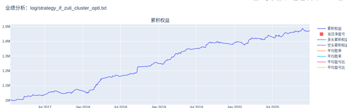

# Strategy-Introduction

Strategy one:  
Stock Index (Index Future China) momentum breakthrough day trading strategy. In the back test from 2017 to 2020, with 1,000,000 initial margin (one position a time), total return 1,020,000, with long and short profit symmetry, profit-loss ratio1.99, Kalmar (profit/max drawdown) 29.87.

Strategy two:  
Stock Index (Index Future China) reverse day trading strategy. In the back test from 2017 to 2020, with 1,000,000 initial margin(one position a time), total return 520,000, with long and short profit symmetry, profit-loss ratio 2.38, Kalmar (profit/max drawdown)30.33. Further transferred into IC, after simple adjustment, 4-year Kalmar reached 15.03, verifying the overfitting problem of this strategy.  

Strategy three:  
Stock Index (Index Future China) fast trend follow day trading strategy. In the back test from 2017 to 2020, with 1,000,000 initial margin (one position a time), total return 1,050,000, with long and short profit symmetry, profit-loss ratio 2.38, Kalmar (profit/max drawdown)30.33. 

# Back-Test-Curve

